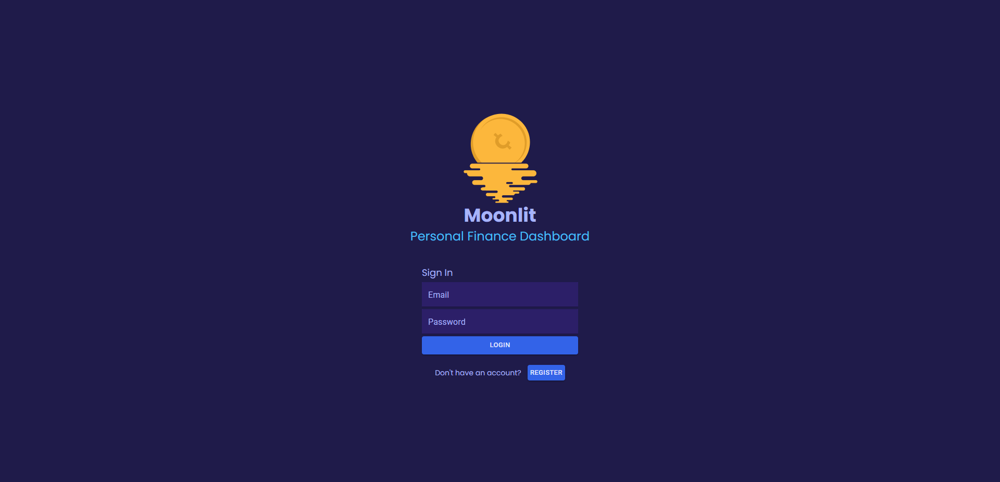
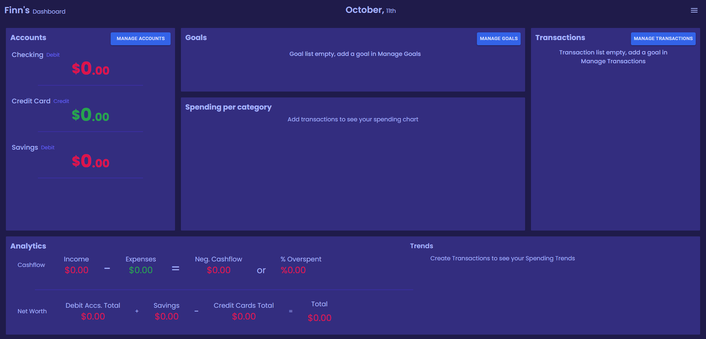
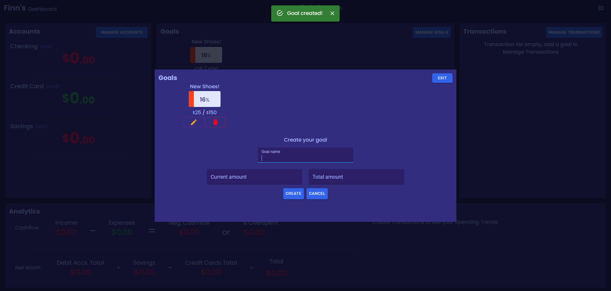
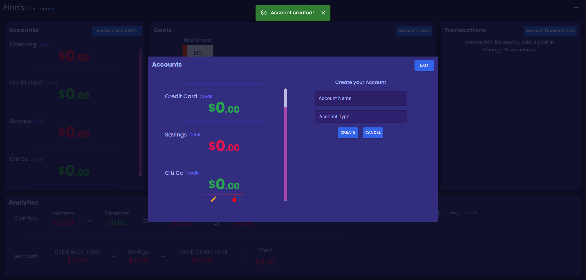
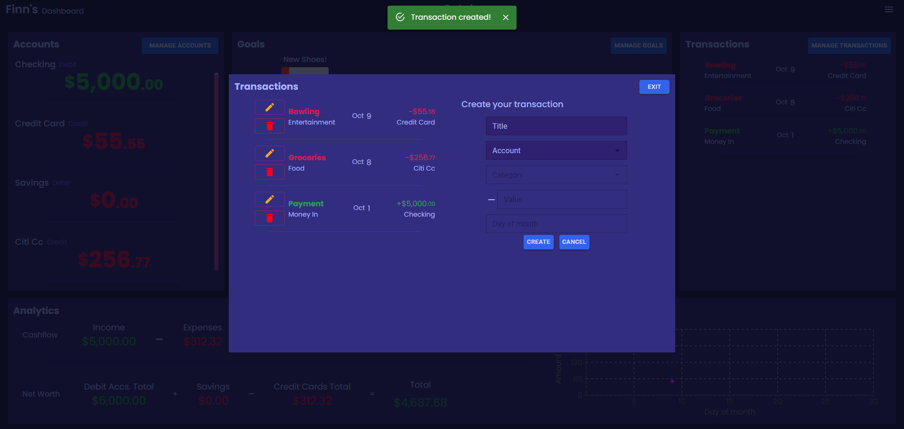
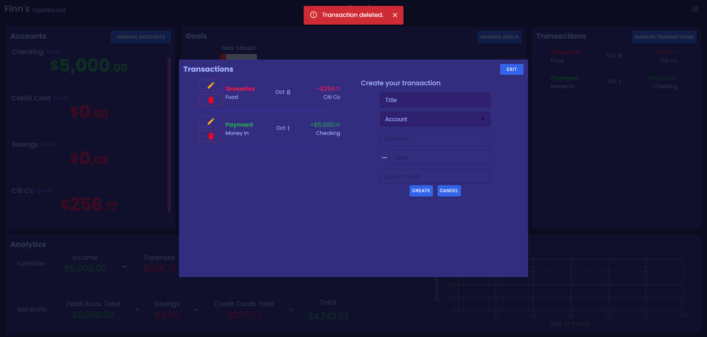
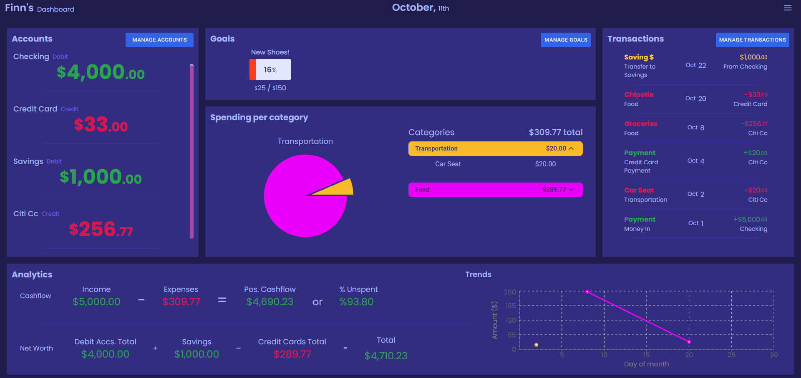
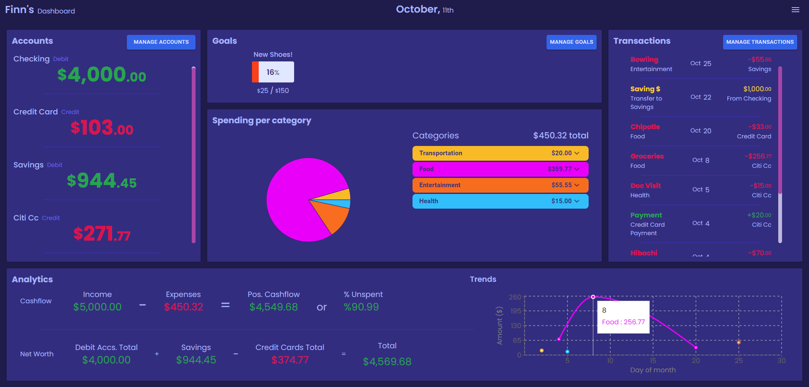
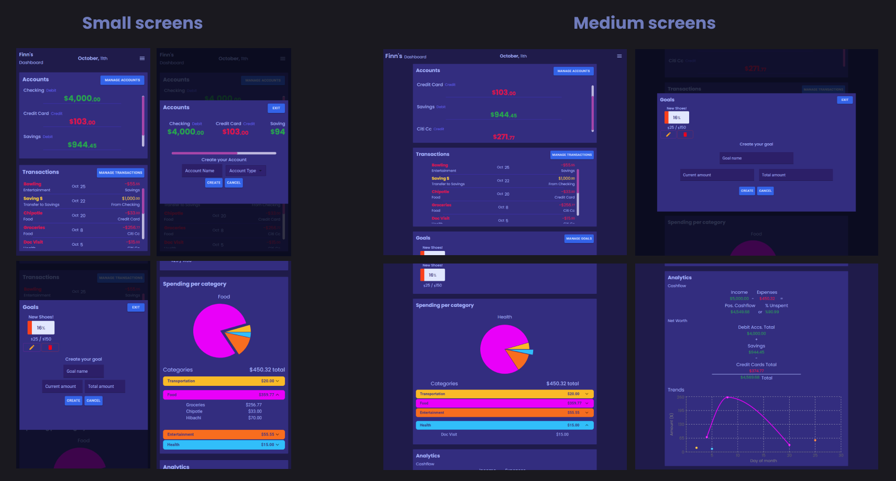
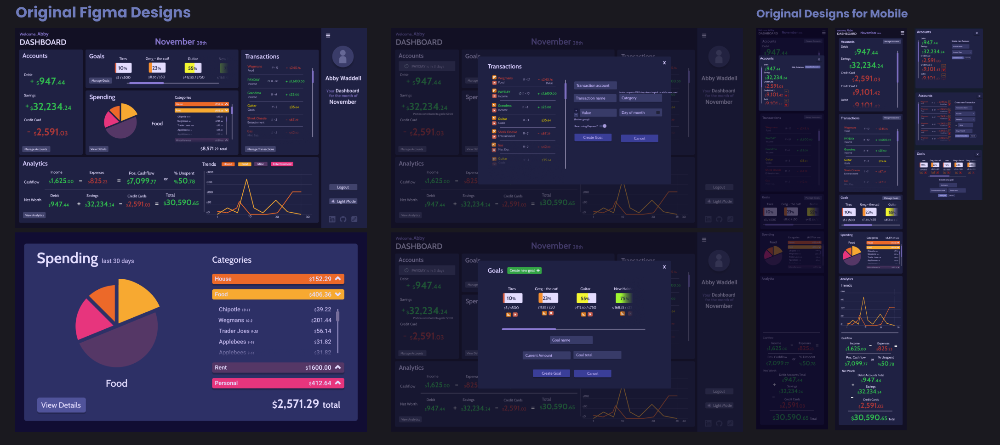

# Moonlit Financial Dashboard

A financial tracking dashboard to watch your monthly spending with graphs & transaction categories so you know where your money is being spent.
Features include:  
* Firebase authentication for secure login 
* A goals modal to keep in mind what you're saving up for and how much you've saved 
* An accounts modal to track what bank accounts have which balance and to add your other accounts 
* Transactions modal provides a way to input your money including expenses, income, Credit Card payments & more! 
* Multiple graphs that help you visualize your spending habits throughout the month 
* A light mode for when dark mode is not enough 
* Custom design and logo made by me :) 

## Deployed on Firebase - <a href="https://financial-dashboard-17bd5.web.app/">Moonlit Financial Dashboard</a>

<a href="https://financial-dashboard-17bd5.web.app/">Moonlit Financial Dashboard</a>

Moonlit is a financial tracking dashboard for those in need of help with knowing where their money goes. To keep your tracking secure, start off by logging in. 

 

Moonlit is powerful, with its 5 different modals you can precisely track your spending. 

 

Add goals to outline the things that youre saving up for & to easily see how much you've saved. 

 

Add accounts and name them to reflect your current active bank accounts 

 

Transactions are at the core of this tracking dashboard, use them to input your expenses, income & more! Your transactions will be reflected into their corresponding account so all transactions in the same account will be added together. 

 

Transactions are able to be created, deleted & edited and will still be correctly translated into their account. 

 

After adding your transactions, take a look at the spending section to see what categories you spend the most on. 

 

Analytics helps you see how much of your money you spend each month & when you spend it. 

 

Moonlit is also available on mobile devices with responsive design. 
<!--  -->
 

Moonlit was designed in Figma, take a look at the dashboards original designs. 

 

## Tech used
* HTML
* CSS
* React
* Tailwind
* Material UI
* Recharts
* Firebase Database
* Firebase Authentication
* Firebase Hosting
* Cypress Testing
* CI/CD with Github Actions
* Designed with accessibility & responsiveness in mind
* Figma

## About Me
Thank you for checking out my work, I hope you enjoyed my site!  
I'm currently searching for a new career opportunity in Web Development and would love to hear from you, so feel free to reach out.  
These are my socials:  
<a href="mailto:Wabby.404@gmail.com">Wabby.404@gmail.com</a>  
<a href="https://wabby404.github.io/portfolio-redo/">Portfolio Site</a>  
<a href="https://github.com/WAbby404">Github</a>  
<a href="https://www.linkedin.com/in/abbywaddell4042/">Linkedin</a>  